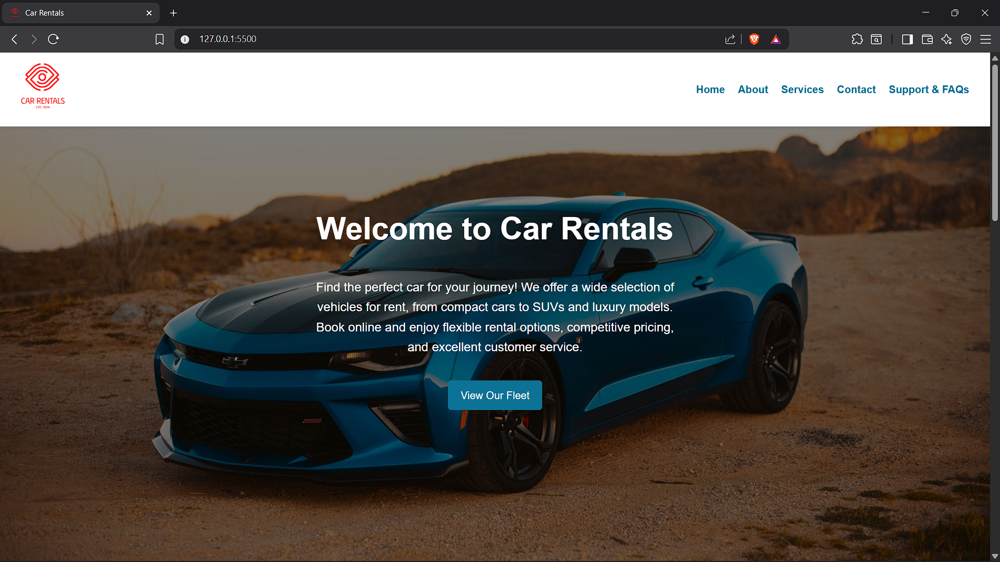
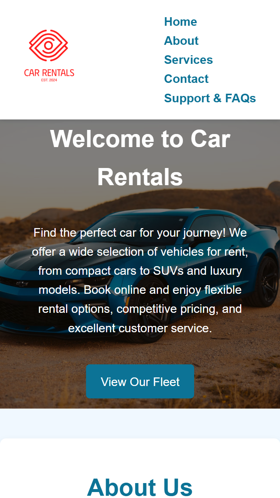

# 🚗 Car Rentals

A modern, responsive, and easy-to-use website for a car rental service. This project showcases a clean user interface, key business features, and dynamic content to provide a seamless user experience for booking a vehicle.

---

## 📑 Table of Contents
- [Features](#-features)
- [Getting Started](#-getting-started)
  - [Prerequisites](#prerequisites)
  - [Installation](#installation)
- [Screenshots](#-screenshots)
- [Deployment & Repository](#-deployment--repository)
- [Assignment Requirements](#-assignment-requirements)

---

## ✨ Features
- **Responsive Design**: The layout is fully optimized to look great and perform flawlessly on all devices, from desktop to mobile. 📱💻  
- **Interactive Dropdown Menus**: Effortless navigation with modern dropdown menus on the main navigation bar, powered by pure JavaScript.  
- **Testimonials Carousel**: A dynamic and engaging testimonial slider on the homepage to build customer trust. 💬  
- **Robust Form Validation**: User-friendly contact and support forms with client-side validation to ensure all required information is captured correctly. ✅  
- **Dynamic Image Gallery**: The services page features a randomizer that displays different images of vehicles each time you visit, adding a fresh look and feel. 🖼️  
- **Contact Modal**: A sleek and interactive modal for contacting support directly from the FAQs page.  

---

## 🚀 Getting Started

To get a copy of this project up and running on your local machine, follow these simple steps.

### Prerequisites
You only need a modern web browser to run this project.

### Installation
Clone the repository:

```bash
git clone https://github.com/masmunge95/plp-webtechnologies-classroom-july2025-july-2025-final-project-and-deployment-Final-Project-and-Depl.git
```

Navigate to your project directory, e.g.:

```bash
cd car-rentals
```

Open **index.html**:  
Simply open the `index.html` file in your preferred web browser.

---

## 📸 Screenshots

### Desktop View


### Mobile View


> ℹ️ To update these screenshots, replace the `desktop-view.png` and `mobile-view.png` files inside the `assets` folder with your own captures.  


---

## 🔗 Deployment & Repository
- **Deployment Link**: https://masmunge95.github.io/plp-webtechnologies-classroom-july2025-july-2025-final-project-and-deployment-Final-Project-and-Depl/  
- **GitHub Repository**: https://github.com/masmunge95/plp-webtechnologies-classroom-july2025-july-2025-final-project-and-deployment-Final-Project-and-Depl.git  

---

## ✅ Assignment Requirements

This project successfully fulfills all the requirements of the assignment:

- **Multipage & Responsive Design**:  
  The website includes multiple pages (`index.html`, `about.html`, `services.html`, `contact.html`, and `support.html`). The CSS is designed to be fully responsive, ensuring optimal viewing on various screen sizes.  

- **HTML5, CSS3, & JavaScript Usage**:  
  The site uses semantic HTML5 for structure, CSS3 for modern styling, and JavaScript for key interactive components, including:  
  - **Form Validation**: The `forms.js` file handles client-side validation for the contact and support forms.  
  - **Image Sliders/Carousels**: The `index.js` file contains a JavaScript-driven testimonial carousel on the homepage.  
  - **Dropdown Menus**: The `nav.js` file manages the interactive dropdown menus on the navigation bar.  
  - **Dynamic Content**: The `services.js` file dynamically changes images on the services page.  

- **Deployment**:  
  The project is structured for easy deployment to platforms like GitHub Pages, Netlify, or Vercel, with a placeholder for the live URL.  

- **Project Submission**:  
  The repository contains all necessary files (HTML, CSS, JS) and this `README.md` serves as the project documentation.  
